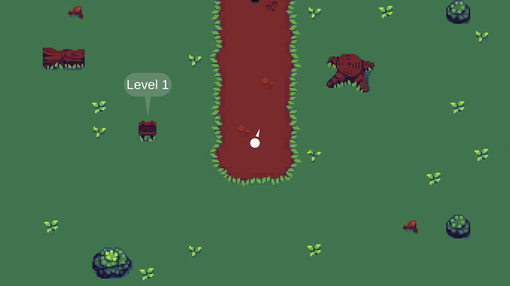
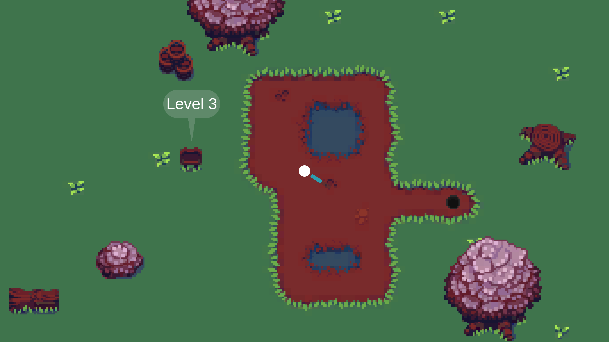

# Prototyping Workshop
A repository housing my game prototypes created during the "Prototyping" course as part of my master's degree at Hochschule Flensburg.

## Prototype 1: One Button Game

The prompt for the first prototype is "One Button Game".
I created a 2D Unity game that revolves around controlling a ball solely using the spacebar. In this game, the direction in which the ball moves rotates around the player. When you press and hold the spacebar, the direction becomes fixed, and the longer you maintain this action, the more forceful your propulsion becomes. Your objective is to reach the level's goal. 

This prototype uses the Tileset [Outdoor Tiles Again](https://opengameart.org/content/outdoor-tiles-again) from [Michele "Buch" Bucelli](https://opengameart.org/content/outdoor-tiles-again).

Level one with direction indicator | Level three with speed indicator
:--------:|:--------:
 | 

## Prototype 2: No Screen

There is no screen allowed in this prototype.
I used Unity to create a multiple choice dialogue about finding yourself in purgatory, where you talk with an automated system to handle new souls. There is also a maze involved, though which you need to traverse with audio cues.