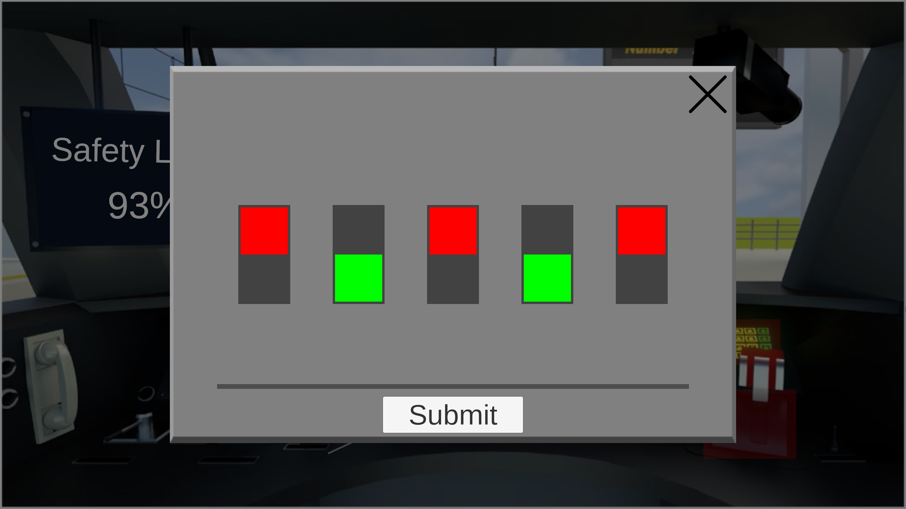

# Prototyping Workshop
A repository housing my game prototypes created during the "Prototyping" course as part of my master's degree at Hochschule Flensburg.

## Prototype 1: One Button Game
**Premise: Develop a prototype that only uses one button as input** 
**Developed with: Unity** 
**Language: None/English**

I created a 2D Unity game that revolves around controlling a ball solely using the spacebar (as only one button is allowed). The ball-direction is indicated with an arrow that rotates around the player, as seen in the first picture. When the player presses and holds the spacebar, the direction becomes fixed, and the longer they maintain this action, the more forceful their propulsion becomes. The objective is to reach the level's goal. 

**External Sources:** This prototype uses the Tileset [Outdoor Tiles Again](https://opengameart.org/content/outdoor-tiles-again) from [Michele "Buch" Bucelli](https://opengameart.org/content/outdoor-tiles-again).

|     Level one with direction indicator      |      Level three with speed indicator       |
|:-------------------------------------------:|:-------------------------------------------:|
|  |  |

## Prototype 2: No Screen
**Premise: Develop a prototype that uses no visual output** 
**Developed with: Unity** 
**Language: German**

I used Unity to create a multiple-choice dialogue about finding oneself in purgatory, where one talks with an automated system that handles new souls. Depending on the player's choice, they will either get obliterated or be sent on their way to find their salvation in an "endless void". The endless void is in the form of a maze, through which the player needs to traverse with audio cues. Once completed, a glitch will reset the game, where the player can either endlessly try to find their salvation or give up and obliterate themselves.

**External Sources:** To create the dialogue audio files, the text-to-speech service https://ttsfree.com/ was used. For the button-press sound modified versions of "Dial 0 on Touch Tone Telephone" to "Dial 9 on Touch Tone Telephone" from https://freesfx.co.uk/sfx/dial were used.

|              Normal game view               |       Developer mode view of the maze       |
|:-------------------------------------------:|:-------------------------------------------:|
|  |  |

## Prototype 3: Pictograms

**Premise: Develop a prototype that only uses pictograms. Original prompt name: 'Susan Kares Dreams'** 
**Developed with: Unity** 
**Language: None**

For this prompt, a 2D incremental auto-clicker game has been created. The task is to click on the phone to gather hearts. Click upgrades can be purchased to increase the number of hearts produced per click. Alternatively, an auto-clicker upgrade is available to perform the clicking automatically. The produced heart amount and the time between clicks can be upgraded as well.
Designing this prototype was challenging, as I couldn't use normal images or even solid-colored rectangles for UI.

**External Sources:** Pictograms by <a href="https://www.flaticon.com/uicons">Flaticon</a>.
For Audio, these sounds were used:
[Click On Phone](https://freesound.org/people/Raclure/sounds/483600/),
[Open/Close Shop](https://freesound.org/people/plasterbrain/sounds/396193/),
[Upgrade Bought](https://freesound.org/people/Jagadamba/sounds/254756/),
[Upgrade Denied](https://freesound.org/people/burnttoys/sounds/9243/)

|                Starting game                | Open shop (right) with auto clicker bought (left from phone) and owned hearts (top left) |
|:-------------------------------------------:|:----------------------------------------------------------------------------------------:|
|  |                                               |

## Prototype 4: Scrolling

**Premise: Develop a prototype with scrolling as the main interaction** 
**Developed with: Unity** 
**Language: English**

For this prompt, a rhythm game has been created. Choose between three different songs to play, where each can be played with x0.8, x1, x.1.5 or x2 speed. Scrolling with the mouse wheel moves the player up and down. The task is to hit the notes with the ball, only playing the note when the player hits it. Each level is generated from a file, where each note is defined.

**External Sources:** The UI-Images are from <a href="https://www.freepik.com/free-vector/hand-drawn-retro-computer-windows-element_41775760.htm#query=windows%20ui&position=3&from_view=keyword&track=ais">Freepik</a>.
The audio for each level is generated with an Oscillator-Script, using elements from [this video](https://www.youtube.com/watch?v=GqHFGMy_51c). For button-clicks, this sound was used: [Button Click](https://freesound.org/people/Jagadamba/sounds/254756/).

|       Main menu with level selection        | Level 3 'Carol of the bells' on double speed |            Level finished screen            |
|:-------------------------------------------:|:--------------------------------------------:|:-------------------------------------------:|
|  |   |  |

## Prototype 5: Read The Fucking Manual (RTFM)

**Premise: Develop a prototype where a manual is needed for** 
**Developed with: Unity** 
**Language: English**

This is a two-player game. Player one has a manual and player two plays on the device. Player one may not see the screen and player two may not see the manual. They need to communicate to solve different problems, each with randomized components. They need to finish their tasks before the safety level reaches 0%.

**External Sources:** 
[Train Interior Image](https://www.axiomtek.com/Default.aspx?MenuId=Solutions&FunctionId=SolutionView&ItemId=1698&Title=Train+Control+System), 
[Background Ticking Sound](https://mixkit.co/free-sound-effects/game/),
[Screwdriver Image](https://www.campbellsci.de/35675),
[Wrong Answer Sound](https://freesound.org/people/burnttoys/sounds/9243/),
[Right Answer Sound](https://freesound.org/people/plasterbrain/sounds/396193/),
[Win Sound](https://pixabay.com/sound-effects/short-crowd-cheer-6713/),
[Lose Sound](https://pixabay.com/sound-effects/fail-144746/).

|                   In-Game                   |              Issue 1 out of 4               |
|:-------------------------------------------:|:-------------------------------------------:|
|  |  |

## Prototype 6: From The Future

**Premise: Develop a prototype with an interface that could be from a Sci-Fi movie** 
**Developed with: Unity** 
**Language: English**

The player is lost in space. They need to use their remaining fuel to travel to planets, collect resources and repair their ship. The goal is to collect 100 Plasma Resin to repair the FTL Drive to fly back home. If there is no fuel remaining, the player will be lost in space, thus failing.

**External Sources:** 
[Sound Effects](https://mixkit.co/free-sound-effects/sci-fi/),
[Spaceship Model](https://sketchfab.com/3d-models/rocket-ship-low-poly-96858de4225f42048c88be630697f9cb#download),
[Space Skybox](https://assetstore.unity.com/packages/2d/textures-materials/sky/spaceskies-free-80503),
[Planet (Moon)](https://astrogeology.usgs.gov/search/map/Moon/LRO/LROC_WAC/Lunar_LRO_LROC-WAC_Mosaic_global_100m_June2013).

|                Start screen                 |               Hover on planet               |
|:-------------------------------------------:|:-------------------------------------------:|
|  |  |
|               **Player Menu**               |       **with Vision Range upgrades**        |
|  |  |
|             **Frontal Camera**              |                                             |
|  |                                             |  

## Prototype 7: Alternative Control

**Premise: Develop a prototype without using a mouse, keyboard, controller,trackpad or touch** 
**Developed with: Unity & Arduino** 
**Language: English**

The player needs to avoid obstacles while travelling through an endlessly generated obstacle course. The goal is to come the farthest. The game is over when the ship collides with an obstacle.
The player controls the direction of the ship with a gyroscope sensor that is positioned on either hand, while the speed is controlled with the other hand using an ultrasound (distance) sensor.
The closer the hand is to the ultrasound sensor, the slower the ship moves. The player can also move their hand up or down to move the ship in that direction. To move either left or right, the player needs to rotate their hand in that direction. For the input an arduino is used that communicates with unity via serial communication.

**External Sources:**
[Background Music](https://uppbeat.io/browse/artist/moire),
[Spaceship Model](https://sketchfab.com/3d-models/rocket-ship-low-poly-96858de4225f42048c88be630697f9cb#download),
[Space Skybox](https://assetstore.unity.com/packages/2d/textures-materials/sky/spaceskies-free-80503)

|                Start screen                 |                                                        Actively playing                                                         |
|:-------------------------------------------:|:-------------------------------------------------------------------------------------------------------------------------------:|
|  |                                                                                      |
|              **Arduino Setup**              |                                               **Demo video (Click on the Image)**                                               |
|  |  |

## Prototype 8: 2 cards 4 u

**Premise: Draw (at least) 2 cards, make a game with what is written on the cards.** 
**Cards Drawn:**
1. "Animal Organ (instrument)" [german: Tierorgel] in reference to the [Piganino](https://en.wikipedia.org/wiki/Piganino). Due to the animal cruelty involved, I decided to reword it to "Animal Harmony"
2. "Skeumorphism & Flat Design" (choose either one)
3. "voting"

**Developed with: Unity** 
**Language: English**

To challenge myself a bit more, I drew a third card. For the animal harmony I decided to implement three animals, each with their own sound and each having 3 different pitches.
The goal is to make a song with the animals and getting all 3 positive votes from the judges. The judges will vote after a certain amount of time, so the player needs to be quick to impress them. Each judge has their own sound preferences and likes/dislikes different animal sounds and sound-combinations.
I decided to spin the theme of the design card a bit and take skeumorphism too extreme, only using stockphotos and text. The UI is designed to look like a stage, with the judges and the animals being on it. 

**External Sources:**
[Cat Sound](https://mixkit.co/free-sound-effects/animals/),
[Cat Images](https://github.com/tndvjd/pop-cat/tree/master/images),
[Dog Sound](https://www.youtube.com/watch?v=h5o5XojstYs),
[Dog Images](https://www.stickpng.com/cat/memes/gabe-the-dog?page=1),
[Pig Sound](https://www.fesliyanstudios.com/royalty-free-sound-effects-download/pig-261),
[Pig Image Singing](https://www.vecteezy.com/png/27394937-surprised-pig-with-huge-eyes),
[Pig Image Neutral](https://www.vecteezy.com/png/27395219-surprised-pig-with-huge-eyes),
[Background Image](https://de.freepik.com/fotos-premium/leeres-fernsehstudio-niemand-fernseher-oder-kabel-neues-netzwerk-live-studio_64189842.htm),
[Judge 1 Images](https://depositphotos.com/de/model/71095139.html),
[Judge 2 Images](https://depositphotos.com/de/model/83302714.html),
[Judge 3 Images](https://depositphotos.com/de/model/83241440.html)

|                Start Screen                 |                 Preparation                 |
|:-------------------------------------------:|:-------------------------------------------:|
|  |  |
|            **Actively Playing**             |               **End Screen**                |
|  |  |

## Prototype 9: Doors

**Premise: Develop a game where doors are the main interaction** 
**Developed with: Unity** 
**Language: English**

In this game you need to escape a dungeon. Look for keys to open doors and find the exit. Break open the escape ladder with an axe, hidden somewhere in the dungeon. There is no fail condition or timer.

**External Sources:**
 Assets:
[Stylized Hand Painted Dungeon](https://assetstore.unity.com/packages/3d/environments/stylized-hand-painted-dungeon-free-173934),
[Low Poly Simple Medieval Props](https://assetstore.unity.com/packages/3d/props/low-poly-simple-medieval-props-258397).
 Background music by 
[Alexander Nakarada - Adventure](https://www.youtube.com/watch?v=0iVgv5OP4so).
 Sound-Effects from Pixabay:
[Keys Collect](https://pixabay.com/sound-effects/key-get-39925/),
[Door Locked](https://pixabay.com/sound-effects/rattling-door-81387/),
[Unlocking Door](https://pixabay.com/sound-effects/locking-door-6854/),
[Opening Door](https://pixabay.com/sound-effects/door-opening-and-closing-46085/),
[Axe Pickup](https://pixabay.com/sound-effects/weapon-axe-drop-01-153371/),
[Axe Hit on Wood](https://pixabay.com/sound-effects/knife-thrust-into-wall-7017/),
[No Axe Hit on Wood](https://pixabay.com/sound-effects/door-rattles-wood-2011-94336/)
[Win](https://pixabay.com/sound-effects/success-fanfare-trumpets-6185/).

|               Picking up key                |            Opening door with key            |
|:-------------------------------------------:|:-------------------------------------------:|
|  |  |
|             **Picking up Axe**              |         **Opening Escape with Axe**         |
|  |  |

## Prototype 10: Mix and Match

**Premise: Develop a game using two of your previous prototypes** 
**Mixed Prototypes: Prototype 1 & 6** 
**Developed with: Unity** 
**Language: English**

The game starts off as a variation of Prototype 1, a minigolf game where you move the ball with one button. In this version the player can aim the ball with their mouse. At the end of level 4, instead of a regular goal, there is a portal to bring the player to the second segment of the game. Instead of regular minigolf, the player controls a spaceship that needs to navigate to the right planet. The gravitational pull of the other planets (and black holes) make it hard to travel through space, for you can only aim and choose where to move while stationary.

**External Sources:**
 Images:
[Black Hole](https://universe.nasa.gov/resources/182/black-hole/),
[Purple Portal](https://www.reddit.com/r/PixelArt/comments/jwbgi5/p_u_r_p_l_e_p_o_r_t_a_l/),
[Planet (Moon)](https://astrogeology.usgs.gov/search/map/Moon/LRO/LROC_WAC/Lunar_LRO_LROC-WAC_Mosaic_global_100m_June2013).
 Tileset:
[Outdoor Tiles Again](https://opengameart.org/content/outdoor-tiles-again) from [Michele "Buch" Bucelli](https://opengameart.org/content/outdoor-tiles-again).
 Models:
[Spaceship Model](https://sketchfab.com/3d-models/rocket-ship-low-poly-96858de4225f42048c88be630697f9cb#download).

|               Level 3 with slight change    |   Portal in level 4 to space           |
|:-------------------------------------------:|:-------------------------------------------:|
|  |  |
|             **Using gravity to ones advantage**              |         **Maneuvering around black holes**         |
|  |  |

## Prototype 11: Free Topic

**Premise: Develop a game of your choosing. You need to be able to name a topic** 
**Chosen Topic: Resource Management** 
**Developed with: Unity** 
**Language: None/English**

This prototype is relatively simple. Harvest resources, expand the landmass and build a house. 

**External Sources:**
 Images:
[Dinosaur Sprites](https://arks.itch.io/dino-characters).
 Sounds:
[Background Music - Delightful by Ahjay Stelino](https://www.youtube.com/watch?v=sSGFsE_auao),
[Buy](https://mixkit.co/free-sound-effects/bell/),
[Harvest](https://mixkit.co/free-sound-effects/roar/).
 Models:
[House Model](https://assetstore.unity.com/packages/3d/environments/fantasy/lowpoly-baker-s-house-26443).

|               Start   |   Harvesting Resources           |
|:-------------------------------------------:|:-------------------------------------------:|
|  |  |
|             **Land with Iron Ore**              |         **House at the end of the prototype**         |
|  |  |
